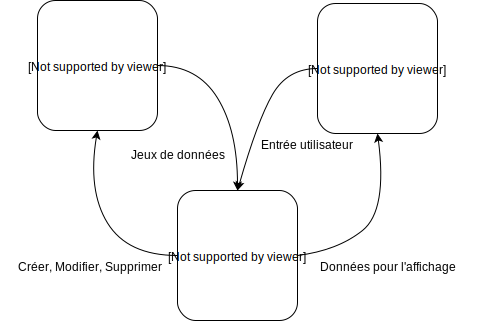
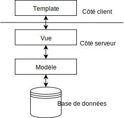

La structure du projet
======================

Le principe MVT
---------------

Django est un framework suivant le modèle MVT (Model-View-Template) aussi appelé MTV (Model-Template-View).

	Diagramme MVT

On peut ainsi voir que la Vue gère la logique d'application, le modèle gère la structure de la base de données et communique avec elle et la vue effectue la logique de l'application. Décris comme ça, cela fait penser au modèle MVC (Model-View-Controller) mais évitons de nous complexifier les choses. Disons que c'est assez proche mais qu'il y a quelques différences (déjà au niveau du nommage).

On peut également représenter le tout sous une autre forme, plus simple à comprendre et visualiser en aplatissant le diagramme. Cela représente mieux ce qui se passe.

	Diagramme MVT aplati

Cette représentation permet de se représenter les interactions sous formes de couches. Avec ça en tête, ce sera plus simple d’appréhender la manière dont est découpé le projet.

Le découpage en applications
----------------------------

| /projet
|    **sith/**
|    	Application principale du projet.
|    **accounting/**
|    	Ajoute un système de comptabilité.
|    **api/**
|    	Application où mettre les endpoints publiques d'API.
|    **club/**
|    	Contient les modèles liés aux clubs et assos et ajoute leur gestion.
|    **com/**
|    	Fournis des outils de communications aux clubs (weekmail, affiches…).
|    **core/**
|    	Application la plus importante. Contient les principales surcouches
|    	liées au projet comme la gestion des droits et les templates de base.
|    **counter/**
|    	Ajoute des comptoirs de vente pour les clubs et gère les ventes sur les lieux de vie.
|    **data/**
|    	Contient les fichiers statiques ajoutés par les utilisateurs.
|    	N'est pas suivi par Git.
|    **doc/**
|    	Contient la documentation du projet.
|    **eboutic/**
|    	Ajoute le comptoir de vente en ligne. Permet d'acheter en carte bancaire.
|    **election/**
|    	Ajoute un système d'élection permettant d'élire les représentants étudiants.
|    **forum/**
|    	Ajoute un forum de discussion.
|    **launderette/**
|    	Permet la gestion des laveries.
|    **locale/**
|    	Contient les fichiers de traduction.
|    **matmat/**
|    	Système de recherche de membres.
|    **pedagogy/**
|    	Contient le guide des UVs.
|    **rootplace/**
|    	Ajoute des outils destinés aux administrateurs.
|    **static/**
|    	Contient l'ensemble des fichiers statiques ajoutés par les développeurs.
|    	Ce dossier est généré par le framework, il est surtout utile en production ;
|        évitez d'y toucher pendant le développement.
|    	Ce dossier n'est pas suivi par Git.
|    **stock/**
|    	Système de gestion des stocks.
|    **subscription/**
|    	Ajoute la gestion des cotisations des membres.
|    **trombi/**
|    	Permet la génération du trombinoscope des élèves en fin de cursus.
|    **.coveragec**
|    	Configure l'outil permettant de calculer la couverture des tests sur le projet.
|    **.gitignore**
|    	Permet de définir quels fichiers sont suivis ou non par Git.
|    **.github/**
|        Contient les fichiers de configuration des actions github.
|    **.readthedocs.yml**
|    	Permet de configurer la génération de documentation sur Readthedocs.
|    **.db.sqlite3**
|    	Base de données de développement par défaut. Est automatiquement généré
|    	lors de la configuration du projet en local. N'est pas suivie par Git.
|    **LICENSE**
|    	Licence du projet.
|    **LICENSE.old**
|    	Ancienne licence du projet.
|    **manage.py**
|    	Permet de lancer les commandes liées au framework Django.
|    **migrate.py**
|    	Contiens des scripts de migration à exécuter pour importer les données de l'ancien site.
|    **README.md**
|    	Fichier de README. À lire pour avoir des informations sur le projet.
|    **pyproject.toml**
|    	Contient les dépendances Python du projet.

L'application principale
------------------------

| /sith
| 	**__init__.py**
| 		Permet de définir le dossier comme un package Python.
| 		Ce fichier est vide.
| 	**settings.py**
| 		Contient les paramètres par défaut du projet.
| 		Ce fichier est versionné et fait partie intégrant de celui-ci.
| 		Notez que les informations sensibles qui se trouvent dans ce fichier
| 		ne sont pas celles utilisées en production.
| 		Ce sont des paramètres factices préremplies pour faciliter la mise en place
| 		du projet qui sont surchargés en production par les vrais paramètres.
| 	**settings_custom.py**
| 		Contient les paramètres spécifiques à l'installation courante.
| 		Ce fichier n'est pas versionné et surcharge les paramètres par défaut.
| 	**urls.py**
| 		Contient les routes d'URLs racines du projet.
| 		On y inclut les autres fichiers d'URLs et leur namespace.
| 	**toolbar_debug.py**
| 		Contient la configuration de la barre de debug à gauche à destination
| 		du site de développement.
| 	**et_keys/**
| 		Contiens la clef publique du système de paiement E-Transactions.

.. warning::

	Ne pas mettre de configuration personnelle ni aucun mot de passe dans **settings.py**. Si il y a besoin de ce genre de chose, il faut le mettre dans **settings_custom.py** qui lui n'est pas versionné.

Le contenu d'une application
----------------------------

| /app1
| 	**__init__.py**
| 		Permet de définir le dossier comme un package Python.
| 	**models.py**
| 		C'est là que les modèles sont définis. Ces classes définissent
| 		les tables dans la base de données.
| 	**views.py**
| 		C'est là où les vues sont définies.
| 	**admin.py**
| 		C'est là que l'on déclare quels modèles doivent apparaître
| 		dans l'interface du module d'administration de Django.
| 	**tests.py**
| 		Ce fichier contient les tests fonctionnels, unitaires
| 		et d'intégrations qui sont lancés par la pipeline.
| 	**urls.py**
| 		On y définit les URLs de l'application et on les lie aux vues.
| 	**migrations/**
| 		Ce dossier sert à stocker les fichiers de migration de la base
| 		de données générés par la commande *makemigrations*.
| 	**templates/**
| 		Ce dossier-ci contient généralement des sous-dossiers et sert
| 		à accueillir les templates. Les sous dossiers servent de namespace.
