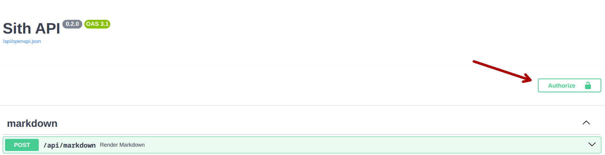
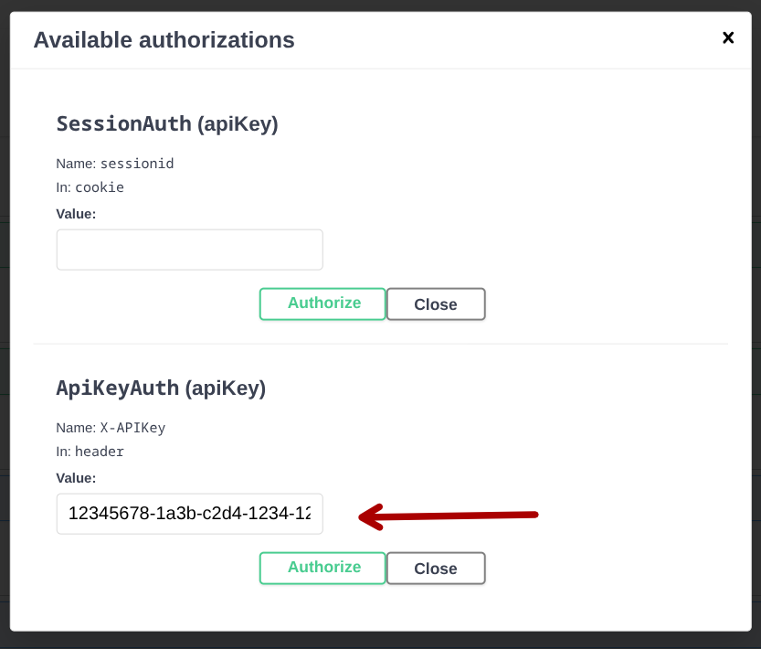

La connexion à l'API du site AE peut se faire par deux moyens :

- par le cookie de session du site ; si vous accédez à l'API depuis le sith
  en étant connecté, cette méthode fonctionne par défaut
- par clef d'API ; si vous accédez à l'API depuis une application externe,
  vous devez passer par cette méthode.

Comme la méthode par cookie de session ne devrait pas être utilisée
en dehors du cadre interne au site et qu'elle marche par défaut
dans le cadre de ce dernier, nous ne décrirons pas outre mesure la manière
de l'utiliser.

## Obtenir une clef d'API

Il n'y a, à l'heure actuelle, pas d'interface accessible sur le site
pour obtenir une clef d'API.
Si vous désirez en obtenir une, demandez directement au respo info.

!!!danger

    Votre clef d'API doit rester secrète.
    Ne la transmettez à personne, ne l'inscrivez pas en dur dans votre code.

    Si votre clef a fuité, ou que vous soupçonnez qu'elle ait pu fuiter,
    informez-en immédiatement l'équipe informatique !

## L'interface Swagger

Avant de commencer à utiliser l'API du site, vous pouvez explorer
les différentes routes qu'elle met à disposition, 
avec les schémas de données attendus en requête et en réponse.

Pour cela, vous pouvez vous rendre sur
[https://ae.utbm.fr/api/docs](https://ae.utbm.fr/api/docs).

Toutes les routes, à de rares exceptions près, y sont recensées.
Vous pouvez les utiliser dans les limites 
de ce à quoi vos permissions vous donnent droit
et de la méthode d'authentification.

Vous pouvez vous connecter directement sur l'interface Swagger,
en cliquant sur ce bouton, en haut à droite :


/// caption
Bouton d'autorisation sur Swagger
///

Puis rentrez votre clef d'API dans le champ prévu à cet effet,
et cliquez sur authorize :



/// caption
Saisie de la clef d'API
///

Les routes accessibles avec une clef d'API seront alors marquées par 
une icône de cadenas fermé, sur la droite.

!!!warning "Authentification et permissions"

    L'icône de cadenas signifie que la route accepte l'authentification
    basée sur les clefs d'API, mais pas forcément que vous avez les 
    permissions nécessaires.
    
    Si une route vous renvoie une erreur 403, 
    référez-en à l'équipe info, pour qu'elle puisse vous donner
    les permissions nécessaires.

## Utiliser la clef d'API

### `X-APIKey`

Maintenant que vous avez la clef d'API,
il faut l'utiliser pour authentifier votre application
lorsqu'elle effectue des requêtes au site.

Pour cela, vous devez le fournir dans vos requêtes
à travers le header `X-APIKey`.

Par exemple :

```shell
curl "https://ae.utbm.fr/api/club/1" \
  -H "X-APIKey: <votre clef d'API>"
```

Comme votre clef d'API doit rester absolument secrète,
vous ne devez en aucun cas la mettre dans votre code.
À la place, vous pouvez créer un fichier (par exemple, un `.env`)
qui contiendra votre clef et qui sera gitignoré.

```dotenv title=".env"
API_KEY="<votre clef d'API>"
```

Vous fournirez alors la clef d'API en la chargeant depuis votre environnement.
Notez que c'est une bonne pratique à double-titre,
puisque vous pouvez ainsi aisément changer votre clef d'API.

### Connexion persistante

La plupart des librairies permettant d'effectuer des requêtes
HTTP incluent une prise en charge des sessions persistantes.
Nous vous recommandons fortement d'utiliser ces fonctionnalités,
puisqu'elles permettent de rendre votre code plus simple
(vous n'aurez à renseigner votre clef d'API qu'une seule fois)
et plus efficace (réutiliser la même connexion plutôt que d'en créer
une nouvelle à chaque requête peut résulter en un gain de performance significatif ; 
cf. [HTTP persistant connection (wikipedia)](https://en.wikipedia.org/wiki/HTTP_persistent_connection))

Voici quelques exemples : 

=== "Python (requests)"

    Dépendances :

    - `requests` (>=2.32)
    - `environs` (>=14.1)

    ```python
    import requests
    from environs import Env

    env = Env()
    env.read_env()

    with requests.Session() as session:
        session.headers["X-APIKey"] = env.str("API_KEY")
        response = session.get("https://ae.utbm.fr/api/club/1")
        print(response.json())
    ```

=== "Python (aiohttp)"

    Dépendances :

    - `aiohttp` (>=3.11)
    - `environs` (>=14.1)

    ```python
    import aiohttp
    import asyncio
    from environs import Env

    env = Env()
    env.read_env()

    async def main():
        async with aiohttp.ClientSession(
            base_url="https://ae.utbm.fr/api/",
            headers={"X-APIKey": env.str("API_KEY")}
        ) as session:
            async with session.get("club/1") as res:
                print(await res.json())

    asyncio.run(main())
    ```

=== "Javascript (axios)"

    Dépendances :

    - `axios` (>=1.9)
    - `dotenv` (>=16.5)

    ```javascript
    import { axios } from "axios";
    import { config } from "dotenv";

    config();

    const instance = axios.create({
        baseUrl: "https://ae.utbm.fr/api/",
        headers: { "X-APIKey": process.env.API_KEY }
    });
    console.log(await instance.get("club/1").json());
    ```

=== "Rust (reqwest)"

    Dépendances :
    
    - `reqwest` (>= 0.12, features `json` et `gzip`)
    - `tokio` (>= 1.44, feature `derive`)
    - `dotenvy` (>= 0.15)

    ```rust
    use reqwest::Client;
    use reqwest::header::{HeaderMap, HeaderValue};
    use dotenvy::EnvLoader;


    #[tokio::main]
    async fn main() -> Result<(), Box<dyn std::error::Error>> {
        let env = EnvLoader::new().load()?;
        let mut headers = HeaderMap::new();
        let mut api_key = HeaderValue::from_str(env.var("API_KEY")?.as_str());
        api_key.set_sensitive(true);
        headers.insert("X-APIKey", api_key);
        let client = Client::builder()
            .default_headers(headers)
            .gzip(true)
            .build()?;
        let resp = client
            .get("https://ae.utbm.fr/api/club/1")
            .send()
            .await?
            .json()
            .await?;
        println!("{resp:#?}");
        Ok(())
    }
    ```
