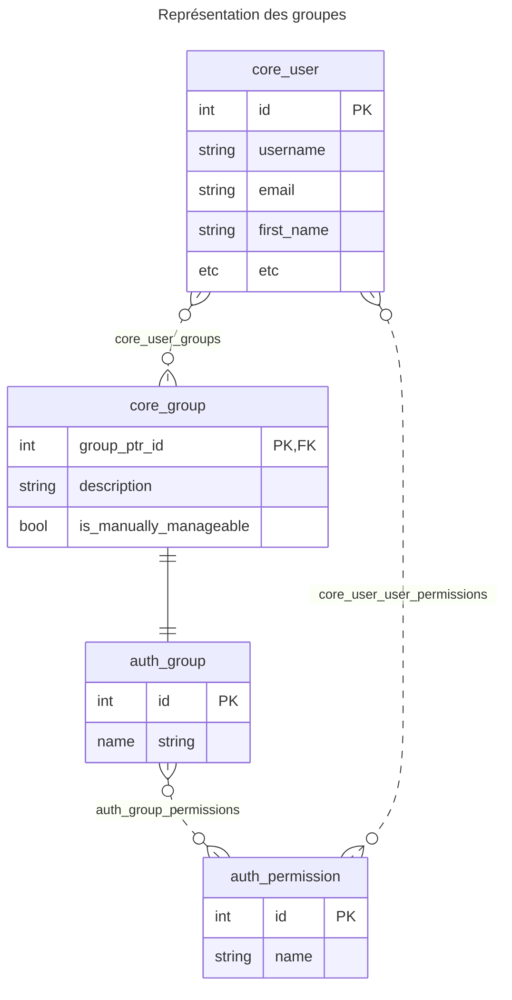

## Un peu d'histoire

Par défaut, Django met à disposition un modèle `Group`,
lié par clef étrangère au modèle `User`.
Pour créer un système de gestion des groupes qui semblait plus
approprié aux développeurs initiaux, un nouveau
modèle [core.models.Group][]
a été crée, et la relation de clef étrangère a été modifiée
pour lier [core.models.User][] à ce dernier.

L'ancien modèle `Group` était implicitement
divisé en deux catégories :

- les *méta-groupes* : groupes liés aux clubs et créés à la volée.
  Ces groupes n'étaient liés par clef étrangère à aucun utilisateur.
  Ils étaient récupérés à partir de leur nom uniquement
  et étaient plus une indirection pour désigner l'appartenance à un club
  que des groupes à proprement parler.
- les *groupes réels* : groupes créés à la main 
  et souvent hardcodés dans la configuration.

Cependant, ce nouveau système s'éloignait trop du cadre de Django
et a fini par devenir une gêne.
La vérification des droits lors des opérations est devenue
une opération complexe et coûteuse en temps.

La gestion des groupes a donc été modifiée pour recoller un
peu plus au cadre de Django.
Toutefois, il n'a pas été tenté de revenir à 100%
sur l'architecture prônée par Django.

D'une part, cela représentait un risque pour le succès de l'application 
de la migration sur la base de données de production.

D'autre part, si une autre architecture a été tentée au début, 
ce n'était pas sans raison :
ce que nous voulons modéliser sur le site AE n'est pas
complètement modélisable avec ce qu'offre Django.
Il faut donc bien garder une surcouche au-dessus de l'authentification
de Django.
Tout le défi est de réussir à maintenir cette surcouche aussi fine
que possible sans limiter ce que nous voulons faire.

## Représentation en base de données

Le modèle [core.models.Group][] a donc été légèrement remanié
et la distinction entre groupes méta et groupes réels a été plus ou moins
supprimée.
La liaison de clef étrangère se fait toujours entre [core.models.User][]
et [core.models.Group][].

Cependant, il y a une subtilité.
Depuis le début, le modèle `Group` de django n'a jamais disparu.
En effet, lorsqu'un modèle hérite d'un modèle qui n'est pas
abstrait, Django garde les deux tables et les lie
par une clef étrangère unique de clef primaire à clef primaire
(pour plus de détail, lire 
[la doc de django sur l'héritage de modèle](https://docs.djangoproject.com/fr/stable/topics/db/models/#model-inheritance))

L'organisation réelle de notre système de groupes
est donc la suivante :
<!-- J'ai utilisé un diagramme entité-relation
 au lieu d'un diagramme de db, parce que Mermaid n'a que 
 le diagramme entité-relation. -->



Cette organisation, rajoute une certaine complexité,
mais celle-ci est presque entièrement gérée par django,
ce qui fait que la gestion n'est pas tellement plus compliquée
du point de vue du développeur.

Chaque fois qu'un queryset implique notre `Group`
ou le `Group` de django, l'autre modèle est automatiquement
ajouté à la requête par jointure.
De cette façon, on peut manipuler l'un ou l'autre,
sans même se rendre que les tables sont dans des tables séparées.

Par exemple :

=== "python"

    ```python
    from core.models import Group

    Group.objects.all()
    ```

=== "SQL généré"

    ```sql
    SELECT "auth_group"."id",
           "auth_group"."name",
           "core_group"."group_ptr_id",
           "core_group"."is_manually_manageable",
           "core_group"."description"
    FROM "core_group"
             INNER JOIN "auth_group" ON ("core_group"."group_ptr_id" = "auth_group"."id")
    ```

!!!warning

    Django réussit à abstraire assez bien la logique relationnelle.
    Cependant, gardez bien en mémoire que ce n'est pas quelque chose
    de magique et que cette manière de faire a des limitations.
    Par exemple, il devient impossible de `bulk_create`
    des groupes.


## La définition d'un groupe

Un groupe est constitué des informations suivantes :

- son nom : `name`
- sa description : `description` (optionnelle)
- si on autorise sa gestion par les utilisateurs du site : `is_manually_manageable`

Si un groupe est gérable manuellement, alors les administrateurs du site
auront le droit d'assigner des utilisateurs à ce groupe depuis l'interface dédiée.

S'il n'est pas gérable manuellement, on cache aux utilisateurs du site
la gestion des membres de ce groupe.
La gestion se fait alors uniquement "sous le capot",
de manière automatique lors de certains évènements.
Par exemple, lorsqu'un utilisateur rejoint un club,
il est automatiquement ajouté au groupe des membres
du club.
Lorsqu'il quitte le club, il est retiré du groupe.

## Les principaux groupes utilisés

Les groupes les plus notables gérables par les administrateurs du site sont :

- `Root` : administrateur global du site
- `Accounting admin` : les administrateurs de la comptabilité
- `Communication admin` : les administrateurs de la communication
- `Counter admin` : les administrateurs des comptoirs (foyer et autre)
- `SAS admin` : les administrateurs du SAS
- `Forum admin` : les administrateurs du forum
- `Pedagogy admin` : les administrateurs de la pédagogie (guide des UVs)
- `Banned from buying alcohol` : les utilisateurs interdits de vente d'alcool (non mineurs)
- `Banned from counters` : les utilisateurs interdits d'utilisation des comptoirs
- `Banned to subscribe` : les utilisateurs interdits de cotisation


En plus de ces groupes, on peut noter :

- `Public` : tous les utilisateurs du site
- `Subscribers` : tous les cotisants du site
- `Old subscribers` : tous les anciens cotisants


